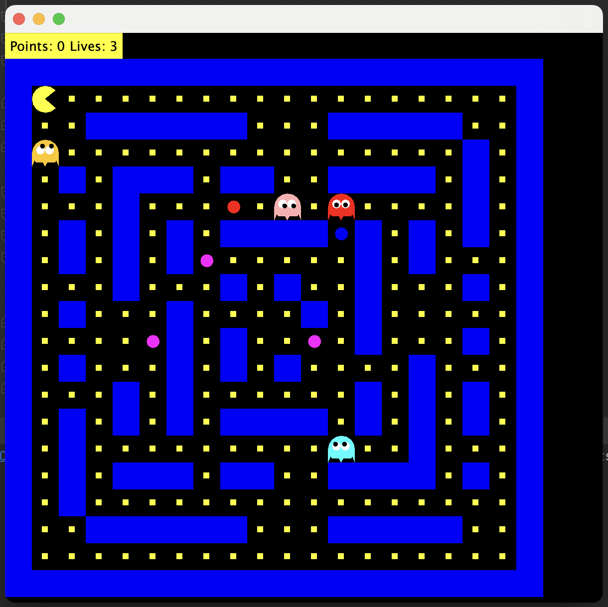

# Pac-Man Game

Pac-Man Game is a simple implementation of the classic arcade game Pac-Man using Java. It provides a basic framework for building and running the game, allowing players to control Pac-Man as he navigates through a maze, eats pellets, and avoids ghosts.

## Features

- Classic Pac-Man gameplay
- Adjustable maze size
- Simple and intuitive controls
- Randomized ghost movement patterns
- Score tracking
- Game over screen with final score display

## Installation

1. Clone the repository to your local machine:

    ```
    git clone https://github.com/dmartseniuk/PacManGame.git
    ```

2. Open the project in your preferred Java IDE (e.g., IntelliJ IDEA, Eclipse).

3. Run the `Main.java` file.

## Usage

- Use the arrow keys (UP, DOWN, LEFT, RIGHT) to control Pac-Man's movement.
- Eat all the pellets in the maze while avoiding contact with ghosts.

## Screenshot



## Contributing

Contributions are welcome! If you'd like to contribute to PacManGame, please fork the repository and submit a pull request with your changes.
